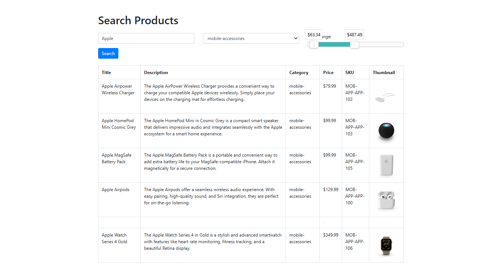

# Fulltext Search in Django

A Django application demonstrating advanced fulltext search capabilities using PostgreSQL. This project implements multiple search strategies including full-text search, trigram similarity matching, and weighted ranking to provide accurate and relevant product search results.



## Features

- **Full-Text Search**: Leverages PostgreSQL's native full-text search functionality
- **Multiple Search Types**:
  - Plain text search (`plainto_tsquery`)
  - Phrase search (`phraseto_tsquery`)
  - Raw query support (`to_tsquery`)
  - Web search syntax (`websearch_to_tsquery`)
- **Trigram Similarity**: Fuzzy matching for typo tolerance and approximate matches
- **Weighted Ranking**: Search results ranked by relevance with weighted fields (title > description > category > SKU)
- **Product Database**: Pre-populated with 2000+ products from the DummyJSON API
- **Web Interface**: Simple, intuitive search interface for end users

## Prerequisites

- Python 3.10+
- PostgreSQL 12+
- pip (Python package manager)

## Installation

### 1. Clone the Repository
```bash
git clone <repository-url>
cd Fulltext-Search-in-Django
```

### 2. Create Virtual Environment
```bash
python -m venv venv
source venv/Scripts/activate  # On Windows
# or
source venv/bin/activate  # On macOS/Linux
```

### 3. Install Dependencies
```bash
pip install -r requirements.txt
```

### 4. Configure Database

Update `textsearch/settings.py` with your PostgreSQL credentials:

```python
DATABASES = {
    'default': {
        'ENGINE': 'django.db.backends.postgresql',
        'NAME': 'textsearch',
        'USER': 'your_postgres_user',
        'PASSWORD': 'your_password',
        'HOST': 'localhost',
        'PORT': '5432',
    }
}
```

### 5. Create Database
```bash
createdb textsearch
```

### 6. Run Migrations
```bash
python manage.py migrate
```

This will:
- Create all database tables
- Enable the `pg_trgm` PostgreSQL extension (required for trigram similarity)

### 7. Populate Product Data
```bash
python manage.py populate_products
```

This command fetches ~2000 products from the [DummyJSON API](https://dummyjson.com) and populates your database.

## Running the Application

```bash
python manage.py runserver
```

Navigate to `http://localhost:8000` in your browser to access the search interface.

## Project Structure

```
Fulltext-Search-in-Django/
├── home/                              # Main app
│   ├── models.py                      # Product model
│   ├── views.py                       # Search logic and view
│   ├── urls.py                        # URL routing
│   ├── management/commands/
│   │   └── populate_products.py       # Data population script
│   ├── migrations/                    # Database migrations
│   └── templates/
│       └── index.html                 # Search interface
├── textsearch/                        # Project settings
│   ├── settings.py                    # Django configuration
│   ├── urls.py                        # Global URL config
│   └── wsgi.py                        # WSGI application
├── manage.py                          # Django management script
└── README.md                          # This file
```

## Search Implementation

The search functionality is implemented in `home/views.py` using Django ORM with PostgreSQL-specific features:

### Key Components

1. **SearchVector**: Creates weighted full-text search vectors across multiple fields
   - Title (Weight A - highest priority)
   - Description (Weight B)
   - Category (Weight C)
   - SKU (Weight D - lowest priority)

2. **SearchQuery**: Processes user input with configurable search types

3. **SearchRank**: Calculates relevance scores based on search vector matches

4. **TrigramSimilarity**: Provides fuzzy matching for typos and similar terms

### Search Logic
```python
products = Product.objects.annotate(
    rank=SearchRank(vector, query),
    similarity=TrigramSimilarity(...)
).filter(
    Q(rank__gte=0.3) | Q(similarity__gte=0.3)
).order_by('-rank', '-similarity')
```

Results are filtered by either full-text rank (≥0.3) or trigram similarity (≥0.3) and sorted by relevance.

## Database Schema

### Product Model
| Field | Type | Description |
|-------|------|-------------|
| title | CharField | Product name (unique) |
| description | TextField | Full product description |
| price | DecimalField | Product price |
| discountPercentage | DecimalField | Discount percentage |
| rating | DecimalField | Product rating |
| stock | IntegerField | Inventory count |
| sku | CharField | Stock keeping unit (unique) |
| category | CharField | Product category |
| thumbnail | URLField | Product thumbnail image URL |

## Performance Considerations

- **GiST Indexes**: PostgreSQL can automatically create GiST indexes on full-text search vectors for improved query performance
- **Trigram Index**: Consider adding a trigram index for high-volume searches:
  ```sql
  CREATE INDEX idx_title_trgm ON home_product USING gist (title gist_trgm_ops);
  ```

## Troubleshooting

### Error: "function similarity(...) does not exist"
This indicates the `pg_trgm` extension is not enabled. The migration (`0004_enable_pg_trgm.py`) handles this automatically, but you can manually enable it:
```sql
CREATE EXTENSION IF NOT EXISTS pg_trgm;
```

### No products showing up
Ensure you've run the population command:
```bash
python manage.py populate_products
```

### Database connection errors
Verify PostgreSQL is running and your connection settings in `settings.py` are correct.
